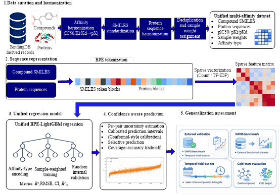

# ConfMux-DTA
A >2M BindingDB-scale confidence-aware unified DTA model for sequence-only pIC50/pKi/pKd prediction, powered by BPE/TF-IDF features and LightGBM with screening-ready uncertainty estimates.
# ConfMux-DTA

<p align="center">
  
</p>

**ConfMux-DTA** is a BindingDB-scale, sequence-only, confidence-aware drug-target affinity (DTA) framework for unified **pIC50 / pKi / pKd** prediction. The model uses compound SMILES and protein amino-acid sequences as inputs, builds BPE/TF-IDF sparse representations, and trains a LightGBM regressor with uncertainty-aware prediction outputs for screening-oriented prioritization.

This repository provides the code needed to reproduce preprocessing, train the model, export a prediction bundle, and run new compound-target predictions. Large datasets and the trained prediction bundle are hosted externally.

## Repository files

| File | Purpose |
|---|---|
| `confmux_dta_bindingdb_preprocess.py` | Preprocess BindingDB full TSV data and export the model-ready CSV. |
| `confmux_dta_train_predict.py` | Train ConfMux-DTA, run validation/cold-start splits, export a prediction bundle, and predict new pairs. |
| `requirements.txt` | Minimal Python dependencies. |
| `README.md` | Usage instructions. |

## Model overview

ConfMux-DTA follows a compact sequence-only workflow:

1. curate BindingDB affinity records and harmonize SMILES/protein sequences;
2. convert Ki, Kd and IC50 measurements to p-space targets;
3. tokenize compound SMILES and protein sequences with BPE;
4. construct sparse TF-IDF feature vectors with affinity-type encoding;
5. train a unified LightGBM regression model;
6. export a self-contained prediction bundle with calibrated uncertainty outputs.

The framework supports random, cold-compound, cold-target and cold-pair evaluation through the `--split_mode` option.

## Installation

Python 3.9 is recommended.

```bash
conda create -n confmux_dta python=3.9.12
conda activate confmux_dta
pip install -r requirements.txt
```

If RDKit installation through pip is not available on your platform, install RDKit from conda-forge first:

```bash
conda install -c conda-forge rdkit=2023.09.3
pip install -r requirements.txt
```

Recommended full-training hardware: Linux workstation/server, >=16 CPU cores, >=32 GB RAM. GPU is optional; the main pipeline is CPU-oriented.

## Data and model downloads

Create the following directories before running examples:

```bash
mkdir -p preprocessed external models examples
```

| Item | Download | Suggested local path |
|---|---|---|
| Preprocessed BindingDB drug-target affinity dataset for ConfMux-DTA training | https://zenodo.org/records/19903083/files/confmux_dta_bindingdb_agg.csv?download=1 | `preprocessed/confmux_dta_bindingdb_agg.csv` |
| DAVIS external validation dataset | https://zenodo.org/records/19904695/files/DAVIS.csv?download=1 | `external/DAVIS.csv` |
| Trained Train-Test prediction bundle | https://zenodo.org/records/20153878/files/predict_bundle.zip?download=1 | `models/predict_bundle/` after extraction |

DOIs: BindingDB processed dataset, https://doi.org/10.5281/zenodo.19903083; DAVIS dataset, https://doi.org/10.5281/zenodo.19904695; trained prediction bundle, https://doi.org/10.5281/zenodo.20153878.

Example download commands:

```bash
wget -O preprocessed/confmux_dta_bindingdb_agg.csv "https://zenodo.org/records/19903083/files/confmux_dta_bindingdb_agg.csv?download=1"
wget -O external/DAVIS.csv "https://zenodo.org/records/19904695/files/DAVIS.csv?download=1"
wget -O models/predict_bundle.zip "https://zenodo.org/records/20153878/files/predict_bundle.zip?download=1"
unzip models/predict_bundle.zip -d models/
```

After extraction, make sure the bundle directory contains `predict_manifest.json`, `best_model.txt`, tokenizers, vectorizers and related metadata. If the ZIP extracts directly into the current directory, move those files into `models/predict_bundle/`.

## Optional preprocessing from raw BindingDB data

For most users, the preprocessed CSV above is sufficient. To rebuild the model-ready CSV from a raw BindingDB full TSV file:

```bash
python confmux_dta_bindingdb_preprocess.py \
    data/BindingDB_All.tsv \
    preprocessed/confmux_dta_bindingdb_agg
```

Expected output:

```text
preprocessed/confmux_dta_bindingdb_agg.csv
```

The preprocessing script reads the BindingDB full TSV, standardizes SMILES, extracts protein sequences, parses affinity endpoints, aggregates repeated measurements and writes the training CSV. ChEMBL cross-reference mapping is optional and is skipped if the local ChEMBL SQLite database is not available.

## Training

### Quick smoke test

Use a small number of boosting iterations to check the environment and file paths:

```bash
python confmux_dta_train_predict.py train_test \
    --data_file preprocessed/confmux_dta_bindingdb_agg.csv \
    --split_mode random \
    --unified \
    --total_iters 2000 \
    --stage_iters 1000 \
    --num_threads 16
```

### Full Train-Test run

```bash
python confmux_dta_train_predict.py train_test \
    --data_file preprocessed/confmux_dta_bindingdb_agg.csv \
    --split_mode random \
    --unified \
    --total_iters 50000 \
    --stage_iters 2000 \
    --num_threads 32
```

Training outputs are written to:

```text
confmux_dta_runs/<timestamp>/train_test/
```

Key outputs include `stage_history.csv`, `best_model.txt`, `fold_summary.json`, `train_test_summary.json`, prediction CSVs for the split, diagnostic plots, and `predict_bundle/` for deployment.

### Cold-start evaluation

```bash
python confmux_dta_train_predict.py train_test --data_file preprocessed/confmux_dta_bindingdb_agg.csv --split_mode compound --unified --total_iters 50000 --stage_iters 2000 --num_threads 32
python confmux_dta_train_predict.py train_test --data_file preprocessed/confmux_dta_bindingdb_agg.csv --split_mode protein  --unified --total_iters 50000 --stage_iters 2000 --num_threads 32
python confmux_dta_train_predict.py train_test --data_file preprocessed/confmux_dta_bindingdb_agg.csv --split_mode pair     --unified --total_iters 50000 --stage_iters 2000 --num_threads 32
```

## Prediction

Prepare an input CSV with at least `smiles` and `protein` columns. If all rows use the same endpoint type, set it with `--affinity_type`. If different rows should be evaluated as different endpoint types, include an optional `affinity_type` column with values `pIC50`, `pKi` or `pKd`.

Example `examples/predict_input.csv`:

```csv
smiles,protein,affinity_type
CC(=O)Nc1ccc(O)cc1,MADEEKLPPGWEKRMSRSSGRVYYFNHITNASQWERPSGNSSSGGK,pIC50
Cn1cnc2c1c(=O)n(C)c(=O)n2C,MKWVTFISLLLLFSSAYSRGVFRRDTHKSEIAHRFKDLGE,pKd
```

Run prediction with the downloaded or newly exported bundle:

```bash
python confmux_dta_train_predict.py predict \
    --bundle_dir models/predict_bundle \
    --in examples/predict_input.csv \
    --out examples/predict_output.csv \
    --affinity_type pIC50 \
    --err_max 0.8
```

Main prediction outputs include the normalized SMILES, cleaned protein sequence, a validity flag, predicted pX value, uncertainty bound, lower/upper prediction interval, selective-prediction acceptance flag, and strong-binder probability. In the unified model, the main prediction column is typically `pred_pX`; the exact names are defined by `predict_manifest.json` inside the prediction bundle.

## Citation

If you use ConfMux-DTA code, data or model outputs, please cite the associated manuscript after publication and cite the Zenodo records for the released datasets/model bundle.
